# Colosseumシリーズビルドガイド

Colosseumシリーズを購入いただきありがとうございます。
組立方法を解説していきます。  

文章で見ると非常に難しく感じるかもしれませんが、
実装の殆どがスルーホールなので、難しいことはあまりないです。  
自分自身これを作る半年前にHelixを組み立てるまで、
ほとんどはんだごてなど触ったことはありませんでした。(どうしてこうなった。。。)  
大丈夫、怖くない、逃げちゃだめだ。

ちょっと*一心不乱になりすぎて*組んでるときに写真を撮るのを忘れています。。。  
文章じゃわかんねえよってときはツイッターで@swan_matchに聞いてください。  
また組み立て写真提供いただけるとありがたいです。  
(しろとりにはもう2基目を作るお財布も労力も残されていません。)

では、はじめます!

## 必要な部品
* Colosseumケース        *  1対
* Promicro              *  2個
* Promicroのおうち      *  2個
* 無限の可能性          *  60key分
* SK6812mini            *  60個
* ダイオード            *  60個
* TRRS JACK             *  2個
* RESET SWITCH          *  2個
* M2ネジ                *  16本
* M2 7mm 六角スペーサー *  8本

<table>
  <tbody>
    <tr>
      <th></th>
      <th>Colosseum44</th>
      <th>Colosseum60</th>
    </tr>
  </tbody>
  <tbody>
    <tr>
      <th>Colosseumケース</th>
      <td colspan="2" style="text-align: center">一対</td>
    </tr>
    <tr>
      <th>Promicro</th>
      <td colspan="2" style="text-align: center">2個</td>
    </tr>
    <tr>
      <th>無限の可能性</th>
      <td style="text-align: center">44個</td>
      <td style="text-align: center">60個</td>
    </tr>
    <tr>
      <th>SK6812mini</th>
      <td style="text-align: center">44個</td>
      <td style="text-align: center">60個</td>
    </tr>
    <tr>
      <th>ダイオード</th>
      <td style="text-align: center">44個</td>
      <td style="text-align: center">60個</td>
    </tr>
    <tr>
      <th>TRRS Jack</th>
      <td colspan="2" style="text-align: center">2個</td>
    </tr>
    <tr>
      <th>RESET SWITCH</th>
      <td colspan="2" style="text-align: center">2個</td>
    </tr>
    <tr>
      <th>M2ネジ</th>
      <td colspan="2" style="text-align: center">16本</td>
    </tr>
    <tr>
      <th>M2 7mm 六角スペーサー</th>
      <td colspan="2" style="text-align: center">8本</td>
    </tr>
    <tr>
      <th>MX互換スイッチ</th>
      <td style="text-align: center">44個</td>
      <td style="text-align: center">60個</td>
    </tr>
    <tr>
      <th>キーキャップ</th>
      <td style="text-align: center">44個</td>
      <td style="text-align: center">60個</td>
    </tr>
    <tr>
      <th>TRRSケーブル(TRSでも可)</th>
      <td colspan="2" style="text-align: center">1本</td>
    </tr>
  </tbody>
</table>

## あると便利なもの(ないと辛いもの)
* 温度調整はんだごて(言わずもがな)
* ブレッドボード(LEDの動作確認)
* ジャンパーピン(LEDの動作確認)
* コンスルー(LEDの動作確認)
* 精密ニッパーまたは棒ヤスリ(無限の可能性のバリ取り)
* ピンセット
* 滑り止めシート

## リセットスイッチ、TRRSJACKの実装
ProMicroのおうちにリセットスイッチとTRRSJACKをはんだ付けします。  
ProMicro部分に四角い枠とJACKというフットプリントが書いてあるほうが表側(Promicro側)、
ピン番号などが書いてあるほうが裏側です。  
ProMicro側にTRRSJACKを、裏側にRESETスイッチをはんだ付けしてください。  
表にRESETスイッチ実装しても押せないです。  
もしピンソケット使いたい場合はここではんだづけしてもいいですが、  
ProMicroはまだはんだ付けしないでください。

## ダイオードの実装
無限の可能性60個にダイオードをはんだ付けします。  
無限の可能性には裏と表があります。  
LED用のPadがあって、D1とか書いてあるほうが裏側、
その逆が表(スイッチ側)となります。  
ダイオードは裏側にはんだづけします。  
向きはフットプリントに向かって見たときに黒い方が右側です。

このとき、余ったダイオードの脚は貧乏臭く取っておくと、
のちのち無限の可能性間のはんだ付けに使えます。

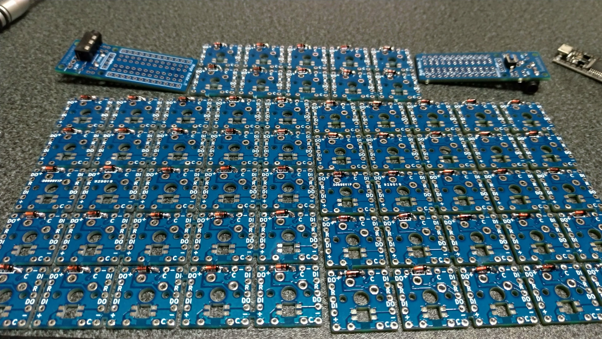

## LED(SK6812mini)の実装
LEDをはんだ付けします。  
向きは正面から見て左上が一番大きいパッドです。  
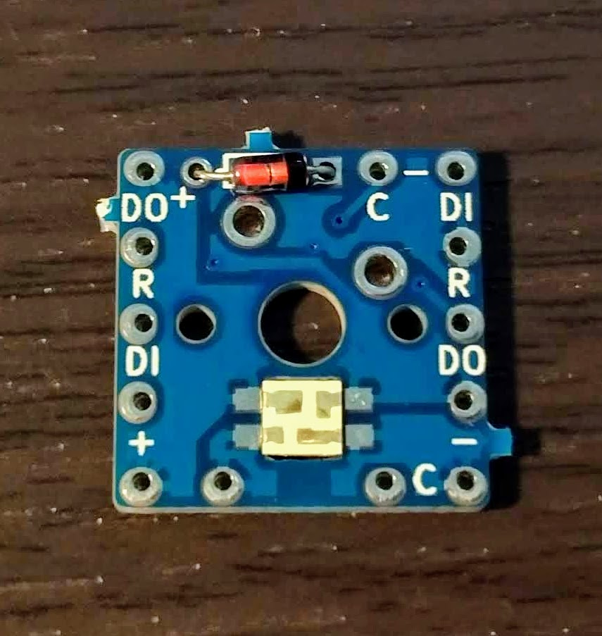

ここは温度調整機能付きはんだごてと低温はんだを使って、
200度くらいで素早くはんだ付けしてください。  
もたもたしているとチップが壊れます。

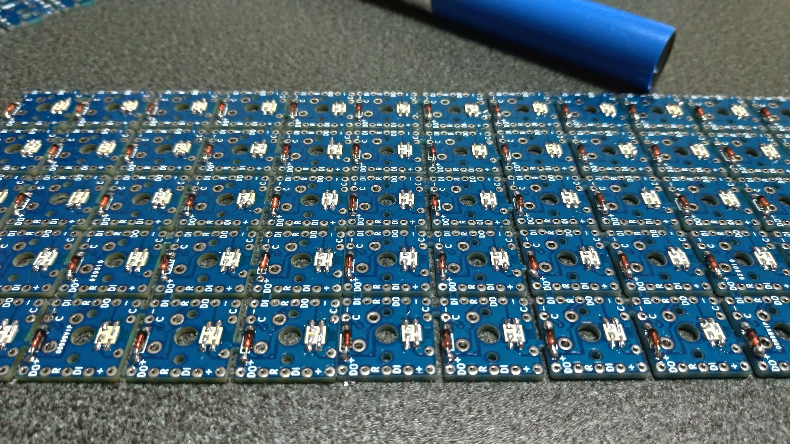

もし不安ならこの段階でhelixのLEDテストなどをProMicroに書き込んで、
ブレッドボードなどで動作確認しておくとよいです。  
とくにProMicroの裏側で後からLED不良が見つかるとリカバリがかなり困難になります。

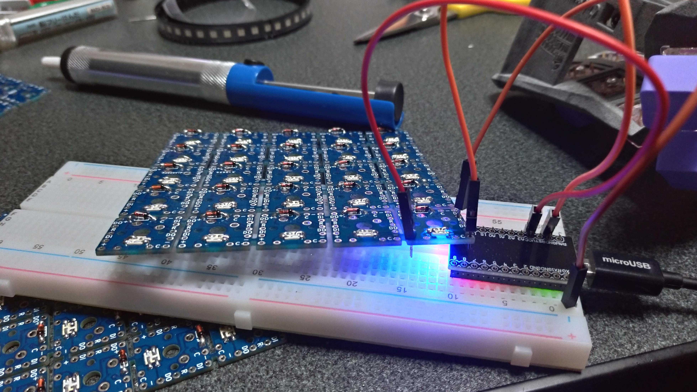

## ProMicroのおうちをネジ止め
M2ネジと7mmスペーサーを使って、ProMicroのおうちをケースに固定しますが、この工程には若干コツがいります。  
まず表側(剣の刻印側)にM2ネジをはめます。  
はめたネジを指で抑えながら裏返して六角スペーサーを指で軽く留めます。  
指で回せるところまで回したら、後はピンセットなどで回してください。  
このネジはドライバーで締めれないため、あとから締め直すことが難しいです。  
なるべくこの段階でキツめに締めておいてください。  

※めんどくさいかたはどうしても4箇所締めなくても対角二箇所でも問題なく固定できるはずです。  
4箇所止めるのは主に見た目の問題です。

あとはTRRSJACKとリセットスイッチを実装した「おうち」を挟んでM2ネジで止めます。  
こっちはドライバーで普通に回せますね。  
ドライバーって素晴らしいって気持ちになると思います。

もう片方も同様に「おうち」を固定してください。

## スイッチと無限の可能性のはんだ付け
お好みのスイッチをケースにはめて、無限の可能性をはめます。  
無限の可能性はケースにしっかりハマるはずです。  
ミシン目のバリが邪魔になってしまう場合があるので、  
ちょっとヤスリがけしてあげると良いです。

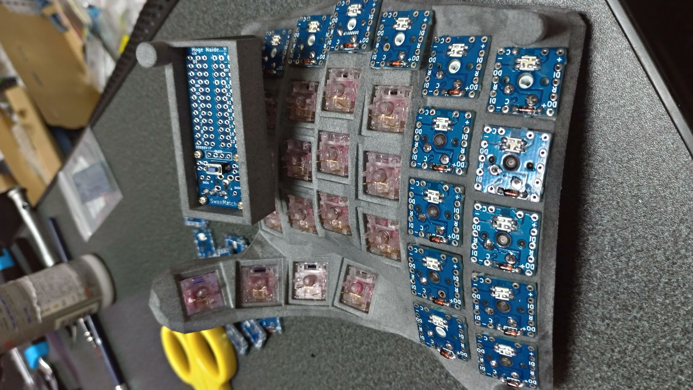

ダブルショットのキーキャップがきれいに透けるよう、一般的(？)なCherry軸とは逆向き(上がLED)での実装してください。  
非常に申し訳ないのですが、無限の可能性のフットプリントは上下逆向きになるのでご注意ください。

逆に親指は上下反転で実装

くどいようですが、ProMicroの裏側のスイッチ(右手5,T,G、左手6,Y,H)はリカバリが困難になります。  
LEDが壊れていないか、スイッチが動作するか、ダイオードの向きなど、再度確認してからはんだづけしてください。

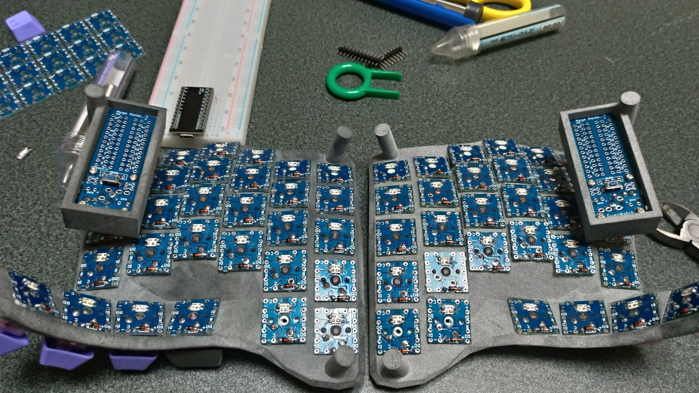

## COLとROWのはんだ付け
さぁここからが本番(?)です。  
全体の配線図はColosseumの神こと@Salicylic_acid3さんに作っていただきました。  
以下を参考にしてください。

 [配線図](https://github.com/swanmatch/colosseum60/tree/master/diagrams)

まずはキーマトリックス回路を実装します。  
特に難しいことはなく、R(Row)とC(Col)をはんだ付けしていきます。  
このとき、前述の通り切り取ったダイオードの脚を使ってジャンパーするといいです。  
手順は、1.挿す、2.折る、3.掴む、4.折る、5.切る、6.くっつける。とすると、ぴったりサイズでできてよいです。

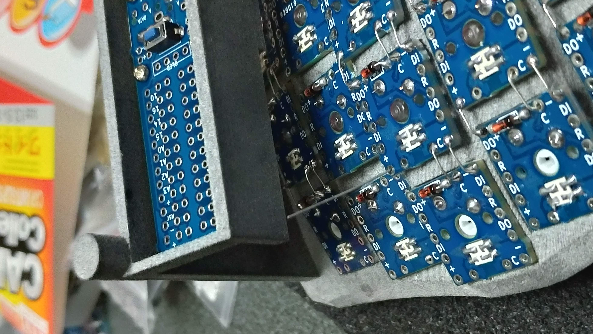
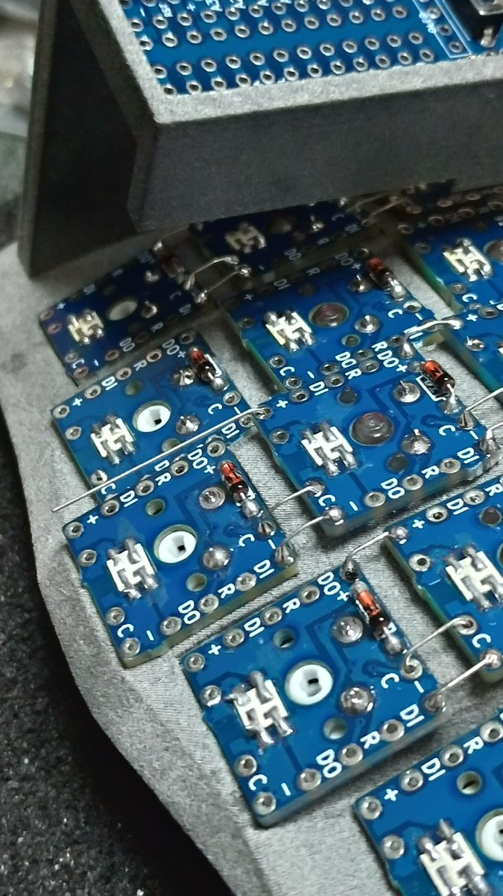
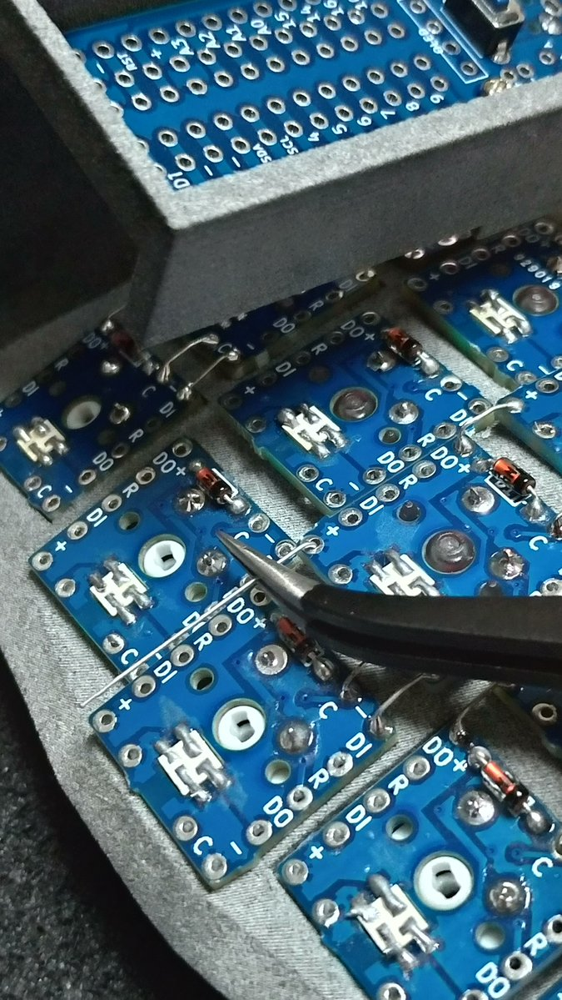
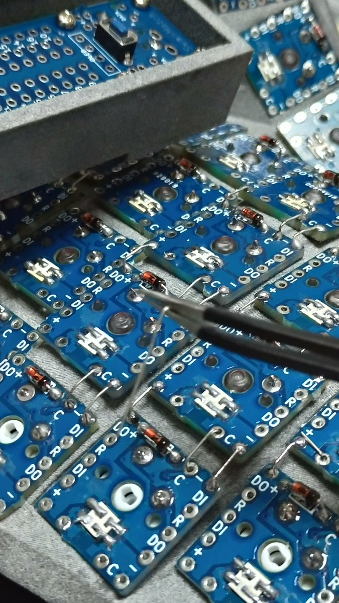

プロマイクロの裏側のジャンパーは作りやすいところでジャンパー作って、ピンセットで持っていくとよいです。

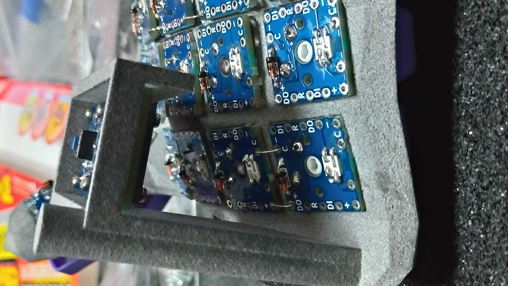

また、4列目と5列目間(左手2と1の列、右手9と0の列)のRow間、
親指4keyのCol間は距離があるのでエナメル線を使用したほうがいいです。

最初はエナメル線の表皮が溶けるか溶けないかの判断が難しいかもしれません。  
エナメル線がぶくぶくしはじめて、半田とエナメル線が馴染みだしだら溶けましたよの合図だと思っています。  
当てすぎてはんだの艶がなくなってきたらフラックスを塗ってあげてください。  
とにかくテスターを当てながら、エナメル線との会話を楽しむことが大切です。  
LED関係のPINは特に注意が必要で、エナメル線溶かすのにもたもたしていると、
熱が伝わってLEDが壊れることがあります。  
ここは逆にはんだごての温度は高め(300度以上)で一気に溶かしたほうがいいです。

終わったらテスターを当てて端から端まで通電していることを確認してください。

## LED用VCCとGNDのはんだ付け
LED用の電源を回していきます。  
まずはColと同様に列ごとはんだ付けしていきます。

列間については自分は右手は「6→N→M→7→8→…」とし、  
親指だけ別のピンから電源取るようにしていて、  
左手は1列目と2列目の間に親指を混ぜるように、  
「5→B→親指一番右→親指一番左→V→4→3…」としています。  
このあたりは手配線ならではのセンスです。
なるべく配線がスッキリするように工夫してみてください。

列間や親指キーは干渉を防ぐためエナメル線を使ってください。

すべての電源配線が終わったら、同じくテスターでGNDとVCCの始点から終点まで導通していることを確認してください。  
エナメル線の溶け方が微妙だったりすると、抵抗になってしまうことがあるので、
導通だけではなく、抵抗値も図っておくとなおよいです。

## LEDの信号線の配線

LEDの信号線はDataOut(DO)→DataIn(DI)にひたすら配線していきます。

LED信号線の回し方も手配線ならではの工夫ポイントです。  
例えばHelixの場合、横方向にジグザクですし、Crkbdの場合縦のジグザグです。  
無限の可能性の場合、横方向にジグザグのほうが配線は楽ですが、  
自分は螺旋状に信号線を回すことをおすすめしています。

とにかく好きなとこから初めて光らせたい順にDO→DI→DO→DIとはんだ付けしてください。  
例によって他に干渉しそうなところはエナメル線を使ってください。

ここまできたら一度ブレッドボードにProMicroをつなげて、
VCC、GND、TX0から最初のキーのDIをつなげてUSBを指してください。  
問題なければ全キー光るはずです。

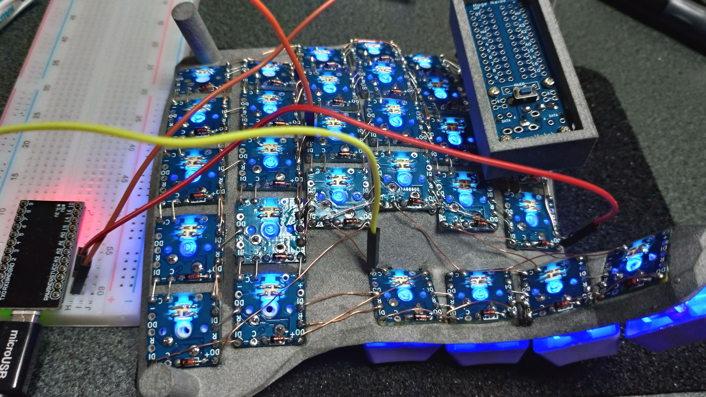

途中で光らなくなっている場合は、光らなくなっているキーの電圧図ってみて、
次に前のキーのDOから光らないキーのDIまでが導通していることを確認してください。  
それでだめなら残念ながらLED自体が死んでいるので交換が必要です。。。

ちなみにマスターの終点のキーのDOをProMicroのおうちの「A」と書いてあるピンにつなげて、
スレーブのAからLEDの始点のDIにつなげてTRRSケーブルを使えば、
ファームの変更は必要ですが、左右同期のLEDMODも実装可能です。(たぶん)

## ProMicroのおうちとの接続

さていよいよ仕上げ工程です!
配線は以下のとおりです。

### Colosseum60
| ProMicro側 | 右手プレート | 左手プレート |
| -- | -- | -- |
| LED | LED信号線始点 | LED信号線始点 |
| +(どこからでも) | VCCの始点 | VCCの始点 |
| -(どこからでも) | GNDの始点 | GNDの始点 |
| 4  | 5のRow | 6のRow |
| 5  | TのRow | YのRow |
| 6  | GのRow | HのROW |
| 7  | BのRow | NのROW |
| 8  | 親指一番端っこのRow | 親指一番端っこのRow |
| A3 | EscのCol | \のCol |
| A2 | 1のCol | 0のCol |
| A1 | 2のCol | 9のCol |
| A0 | 3のCol | 8のCol |
| 15 | 4のCol | 7のCol |
| 14 | 5のCol | 6のCol |

### Colosseum44
| ProMicro側 | 右手プレート | 左手プレート |
| -- | -- | -- |
| LED | LED信号線始点 | LED信号線始点 |
| +(どこからでも) | VCCの始点 | VCCの始点 |
| -(どこからでも) | GNDの始点 | GNDの始点 |
| 4  | TのRow | YのRow |
| 5  | GのRow | HのROW |
| 6  | BのRow | NのROW |
| 7  | 親指一番端っこのRow | 親指一番端っこのRow |
| A3 | TabのCol | =のCol |
| A2 | QのCol | PのCol |
| A1 | WのCol | OのCol |
| A0 | EのCol | IのCol |
| 15 | RのCol | UのCol |
| 14 | TのCol | YのCol |

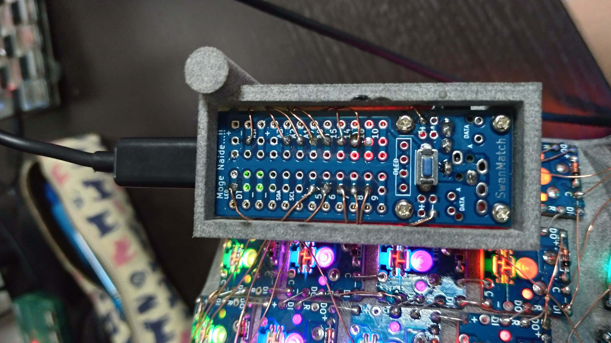

おうちの外脇からエナメル線を通します。  
おうちのProMicroの両端はProMicro自体の脚が刺さるので、
その1列内側の穴にエナメル線を指してはんだ付けします。  
一般的な分割キーボードとちがって、左右対称ではないのでご注意ください。  
もしピンソケットやコンスルーを使ってる場合でも、
*絶対に*ProMicroをはめた状態作業しないでください。  
はんだがProMicroに垂れて修復不可能になります。

あまりエナメル線が空中を縦横無尽してるとかっこ悪いので、
縦配線の下を通すなどすると少し見た目がマシになります。

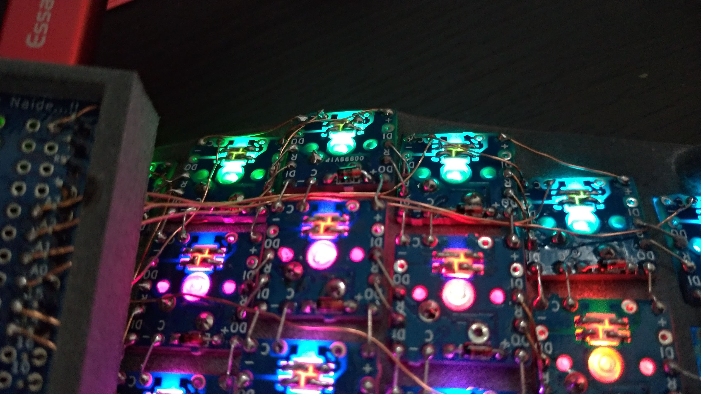

配線が終わったら各線がプレート側まで導通しているかテスターを当てて確認してください。

ソケットやコンスルーをお持ちであれば、
この状態で一度ファームを書き込んで動作確認をおすすめします。  
最終的なPromicroのはんだ付けはベタ付けでもいいと思います。  
モゲたらおうちごと交換すればいいので、コンスルーより安いのです。  
ただ、手間はかかるのでお好みで。

お疲れ様でした!  
最後にProMicroをおうちにはんだ付けして、ファームを書き込んで作業終了です。

最終的にはこんな感じになります。
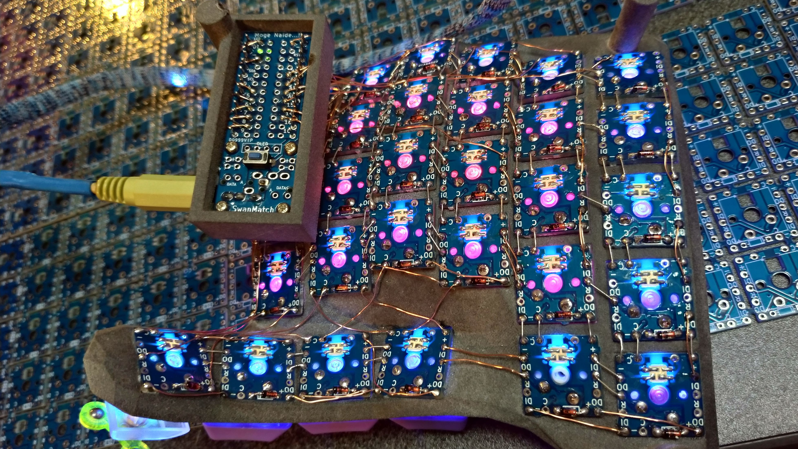

ファームは以下で一応動くことを確認していますが、  
あまり詳しくないので聞かないでください。  
https://github.com/swanmatch/qmk/tree/master/keyboards/colosseum60

